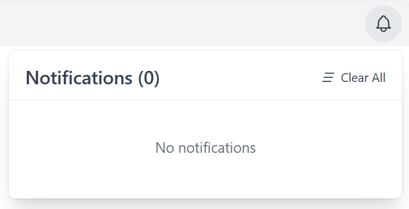
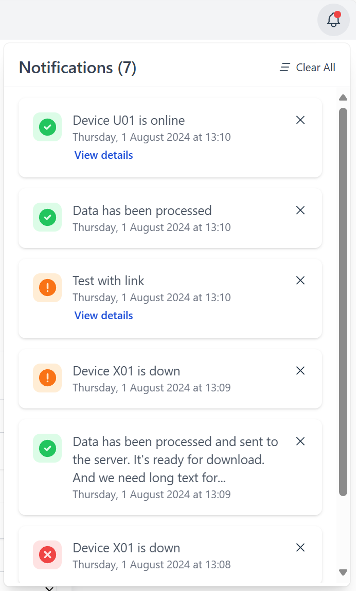

# Notifications

[Live Demo](https://notifications-sim.netlify.app/)

## Getting started

```bash
npm i
npm run dev
```

## Task

Розробити блок із нотифікаціями з емуляцією отримання нотифікацій використовуючи React.

### Інтерфейс:

- пустий хедер
- справа у хедері розміщена іконка дзвіночка
- при натисканні на дзвіночок з'являється блок із нотифікаціями

### Нотифікації

Приклади нотифікацій:

```text
Success: "Data has been processed [2024-06-01 12:23]"
Info: "Device U01 is online [2024-06-01 14:15]"
Alert: "Device X01 is down [2024-06-01 17:45]"
```

- Дизайн: не принциповий, можна використовувати прості прямокутники для відображення нотифікацій.
- Звуковий сигнал: При отриманні нової нотифікації відтворюється звуковий сигнал.
- Закриття нотифікацій: можливість закриття нотифікації при натисканні на іконку хрестика.
- Передбачити можливість відображення великої кількості нотифікацій, які не вміщуються на екрані.
- Текст нотифікацій може бути довгим (від 10 до 100 символів).
- Нотифікації можуть містити посилання на інші сторінки застосунку. 
  - Продумати формат передачі посилань з бекенду.
  - Передбачити захист від потенційних фішинг-атак - додати перевірку на те, що лінки не ведуть кудись на інший сайт.

## Реалізація

**Технічний стек**:

- React Context для простого стейту
- Tailwind CSS для швидкої стилізації
- Headless UI
- Web Audio API для звуків сповіщень

**Особливості**:

- Окремий сервіс для генерації сповіщень, який може бути легко замінено на реальний сервіс
- Конфігураційний файл для дозволених посилань і джерел, щоб перевіряти посилання всередині сповіщень

**Обмеження**:

- Неможливо відтворювати звуки до взаємодії користувача зі сторінкою
- Сповіщення не зберігаються після перезавантаження сторінки

**Що можна покращити**:

- Використовувати Redux для управління станом та реалізації збереження
- Додати віртуальне прокручування для кращої продуктивності з великою кількістю сповіщень
- Показувати сповіщення по мірі надходження, після таймауту переносити в Notification Dropdown
- Додати `action` поле, в якому можна описати різні типи взаємодії з сповіщеннями, а не тільки посилання
- Prop-types/TypeScript/JSDoc для типів
- Дочекатися взаємодії користувача перед спробою відтворення звуків на сторінці (щоб уникнути помилок)
- Надсилати потенційно небезпечні посилання до Sentry або подібного сервісу, щоб ми про них дізнались і змогли знайти їх джерело
- Додати можливість "розгортати" сповіщення з довгим текстом (від 100+ символів)

### Демо

| Сповіщення відсутні                      | Велика кількість сповіщень              |
|------------------------------------------|-----------------------------------------|
|  |  |
